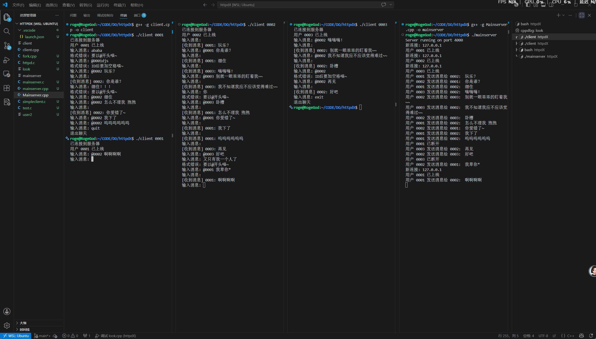

# TinyTalk

基于 C++ 与原生 Socket 实现的轻量级简易聊天程序，包含客户端与服务端，专为初学者学习喵。欢迎交流

---

##  功能特性
- 🖥️ **客户端/服务端架构**：支持多用户同时在线，服务端负责消息转发与连接管理
- 🔌 **原生 Socket 通信**：基于 TCP 协议实现稳定的消息收发
- 📨 **用户间实时聊天**：支持一对一私聊（@用户ID） 有一定可玩性~
- 🧵 **多线程处理**：服务端多线程管理连接，客户端消息收发分离
- 🔒 **线程安全**：连接管理与消息处理均采用互斥锁保证线程安全
- 🚪 **优雅退出**：客户端/服务端异常断开时自动清理资源，无僵尸连接
-    **祝学习愉快 ！！喵**
###   环境要求
- Linux / WSL2 环境
- 支持 C++11 及以上的编译器（如 `g++`）

#### 运行演示
